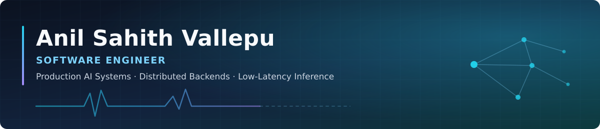

  

# Hi, I'm Anil Sahith Vallepu! 👋

### 💡 Software Engineer | Production AI Systems · Distributed Backends · Low-Latency Inference

Software Engineer with **2+ years building production-scale AI systems**, distributed backend infrastructure, and low-latency ML inference pipelines. I work across **Python and Rust** on LLM applications, multimodal AI, GPU inference optimization, and cloud-native services — architecting systems that process **millions of requests** across Kubernetes, cloud GPUs, and edge devices.

🎙️ Currently **SDE-2 at [Arrowhead AI](https://arrowhead.team)**, building an AI voice-agent platform end to end — the real-time speech pipeline, a WebAssembly plugin runtime, and in-house STT/TTS/LLM models.

🔬 Exploring: **Agentic AI · On-device VLMs · Quantum Computing & Post-Quantum Cryptography**

---

### 🛠️ Tech Stack

#### Languages

#### AI/ML & Inference Optimization

#### LLM & Agentic Systems

#### Backend & Streaming

#### Databases & Vector Stores

#### Cloud & Infrastructure

---

### 💼 Experience

**SDE-2 · Arrowhead AI** — Bangalore, India · *Mar 2026 – Present*
> Building an AI voice-agent platform end to end: the real-time speech pipeline (STT → LLM → TTS), call orchestration, and a plugin runtime.

* Built and deployed **20+ production client integrations as Rust plugins compiled to WebAssembly (Extism)**, connecting the voice platform to partner CRMs and APIs in real time *during live calls*.
* Architected a **platform-wide circuit breaker** driven by PromQL metrics, exposed through REST APIs, MCP tools, and CLI utilities — improving production resiliency and accelerating incident response during live campaigns.
* Contributing to **in-house self-hosted STT, TTS, and LLM models** — dataset generation, fine-tuning (SFT/DPO), and scenario-based evaluation — now powering most production campaigns.

**Software Engineer, AI/ML · Matters.AI** — Bangalore, India · *Dec 2025 – Mar 2026*

* Designed and deployed a **distributed AI inference platform on GKE**, routing OCR and NER workloads across Modal and self-hosted GPU backends over Redis Streams — sustaining **10K RPS ingest** against a controlled 3K RPS downstream, with health-aware routing, rate limiting, and retry/DLQ handling for a **~0.001% failure rate across 1M+ documents**.
* Deployed GPU inference services with **ONNX Runtime, TensorRT, Flash-Attention, and vLLM** — driving p99 latency **below 100 ms for NER** and **below 500 ms for OCR** via async micro-batching and A/B-tested concurrency tuning.
* Built a hybrid **PII/PHI extraction engine** over massive structured and unstructured datasets using **Dask** for distributed parallel execution, integrating VLM and LLM models for image extraction, entity classification, and post-verification.

**AI/ML Engineer · Noccarc Robotics** — Pune, India · *Jun 2024 – May 2025*

* Implemented an **end-to-end real-time ECG arrhythmia detection pipeline** for edge patient monitors — signal preprocessing, deep-learning inference, alarm generation, and frontend visualization — detecting **20+ cardiac abnormalities** and reducing clinical response time in ICU environments.
* Designed a lightweight **ResNet + CBAM + GRU** hybrid network optimized for embedded deployment: **sub-300 ms inference at under 12% single-core CPU** on ARM-based patient-monitoring hardware.

**Summer Intern, ML · Carelon Global Solutions (Elevance Health)** — Bangalore, India · *Jun 2023 – Aug 2023*

* Automated a healthcare document pipeline with **PyTesseract + EasyOCR + OpenCV + YOLOv8**, extracting and classifying **700+ documents/hour at 95% accuracy**; multi-threading and multi-processing cut processing time by **90%**.

---

### 💻 Featured Projects

| Project | What it does | Stack |
| :--- | :--- | :--- |
| **[A Vision Model on a Phone](https://github.com/sahit1011/vlm-on-a-mobile)** | Qwen3-VL-2B running fully **on-device** on a OnePlus 15R, measured to the millisecond. Three runtimes built and raced (llama.cpp on Adreno OpenCL, MNN, LiteRT), a full quantization ladder, and an architecture that turns a 4 s pipeline into a **sub-1.5 s** experience. | `llama.cpp` `Android NDK` `OpenCL` `Quantization` `VLM` |
| **[CryptAI](https://github.com/sahit1011/CryptAI)** · [live ↗](https://cryptai-app.vercel.app) | Autonomous crypto-futures trading engine on a multi-agent architecture — specialized agents analyze markets, identify swing/scalp setups, validate risk, and execute trades over WebSockets, with a live portfolio and agent-activity dashboard. | `Python` `FastAPI` `LangGraph` `Next.js` `Redis` `PostgreSQL` |
| **[StudyArc](https://studyarc-alpha.vercel.app)** | AI adaptive study planner for India's NEET/JEE aspirants — a diagnostic surfaces weak chapters, a monitor → adaptation → remediation agent loop rebalances the plan, plus SM-2 spaced repetition, a live readiness score, and a 24/7 AI tutor. | `Next.js 15` `React 19` `TypeScript` `MongoDB` `AI Agents` |
| **[Klaro · Mini AI Analyst](https://github.com/sahit1011/Full-Stack-MiniAI-As-A-Service)** · [live ↗](https://klaro-vert.vercel.app) | "AI analyst as a service" — upload a CSV and get statistical insights, AutoML model training, and predictions. Production-ready: JWT auth with RBAC, Docker, API docs, and tests. | `Next.js` `FastAPI` `AutoML` `scikit-learn` `Docker` |
| **[SDXL Naruto LoRA](https://github.com/sahit1011/sdxl-naruto-lora)** | LoRA fine-tune of Stable Diffusion XL to the Naruto art style inside a free Colab T4's 16 GB VRAM — training, inference, CLIP-based evaluation, and a technical write-up. | `PyTorch` `Diffusers` `LoRA` `CLIP` |
| **[AI Coding Session Search](https://github.com/sahit1011/AI-Coding-Session)** | Semantic search over AI coding-assistant session history — hybrid BM25 + vector retrieval with cross-encoder reranking and LLM query expansion; Redis caching cut latency ~70%. | `FastAPI` `ChromaDB` `BM25` `React` `Redis` |
| **[SEC Filings QA Agent](https://github.com/sahit1011/SEC-Filings-QA-Agent)** | Agentic RAG over SEC filings — hybrid semantic + metadata retrieval with automatic ticker/date/filing-type extraction and section-level source attribution. | `Python` `FastAPI` `RAG` `Vector DB` `React` |
| **[HSN RAG + Knowledge Graph](https://github.com/sahit1011/HSN_RAG_KnowGraph)** | HSN trade-code classification combining RAG with a knowledge graph — hybrid vector + graph retrieval, a Streamlit chat UI, and a batch-processing CLI. | `Python` `RAG` `Knowledge Graph` `Streamlit` |
| **[MCSC](https://github.com/sahit1011/MCSC)** | Multi-channel scheduling coordinator with cross-thread, cross-channel memory over Email and SMS — LLM-first orchestration (retrieval → outreach planning → fact extraction → drafting) with Chroma retrieval and persistence across restarts. | `TypeScript` `Claude API` `ChromaDB` |

More in [all repositories ↗](https://github.com/sahit1011?tab=repositories) — privacy-preserving ML with FHE, post-quantum crypto simulation, warehouse computer vision, medical RAG, and more.

---

### 📈 GitHub Activity

---

### 🏆 Achievements

* 🥇 **99.3rd percentile in JEE Main** — top 0.7% among 1 million+ candidates
* 🚀 **Top 100 Projects** at the NASA AMES Space Settlement Contest, San Juan, Puerto Rico (2017)
* 💻 **300+ DSA problems** solved on LeetCode (medium–hard)

---

### 🎓 Education

**National Institute of Technology (NIT) Warangal** — B.Tech, Electrical and Electronics Engineering · May 2024

---

### 🔗 Connect With Me

Open to conversations around <b>Software Engineering, Forward Deployed Engineering, AI/ML Engineering, and Data Science</b> roles.

